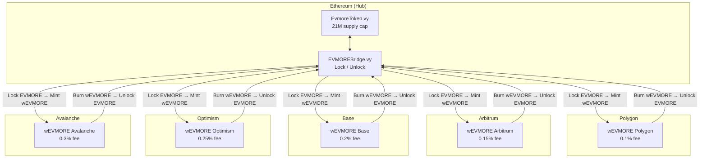
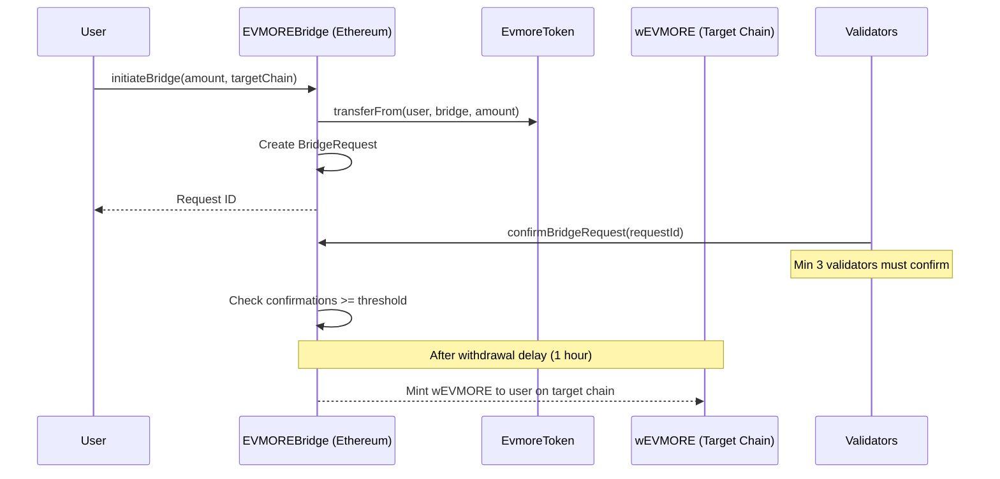

# Cross-Chain Bridge

EVMORE uses a **hub-and-spoke** bridge architecture with Ethereum as the hub. All EVMORE tokens are minted on Ethereum; on other chains, wrapped versions (wEVMORE) are minted when tokens are locked on the hub.

---

## Architecture

---

## How Bridging Works

### Bridging Out (Ethereum to Target Chain)

### Bridging Back (Target Chain to Ethereum)

1. User burns wEVMORE on the target chain
2. Validators confirm the burn
3. After the withdrawal delay, EVMORE is unlocked on Ethereum
4. User receives EVMORE on Ethereum

---

## Chain Configuration

| Chain | Chain ID | Fee | Daily Limit | Max Single Transfer |
|-------|----------|-----|-------------|---------------------|
| Polygon | 137 | 0.1% | 1,000,000 EVMORE | 1,000,000 EVMORE |
| Arbitrum | 42161 | 0.15% | 1,000,000 EVMORE | 1,000,000 EVMORE |
| Base | 8453 | 0.2% | 500,000 EVMORE | 1,000,000 EVMORE |
| Optimism | 10 | 0.25% | 500,000 EVMORE | 1,000,000 EVMORE |
| Avalanche | 43114 | 0.3% | 250,000 EVMORE | 1,000,000 EVMORE |

!!! note
    Ethereum is the hub chain. Bridging _to_ Ethereum is always an unlock operation, not a mint.

---

## Security Model

### Multi-Signature Validation

- Minimum 3 validators required to confirm a bridge request
- Up to 20 active validators supported
- Validators are managed by the contract owner (add/remove)

### Rate Limiting

- **Per-user limit**: 10% of the chain's daily limit
- **Global daily limit**: Per-chain caps as listed above
- **Volume tracking**: Resets every 24 hours

### Withdrawal Delay

All bridge requests have a configurable delay (default: 1 hour) between confirmation and execution. This provides time to detect and respond to suspicious activity.

### Emergency Controls

- `emergencyPause()` -- Immediately halt all bridge operations
- Owner-controlled with instant effect

---

## Fee Revenue

Bridge fees accumulate in the bridge contract and contribute to the project treasury. These fees fund subsequent stage deployments:

| Volume (Monthly) | Fee Revenue (Polygon, 0.1%) |
|-------------------|-----------------------------|
| 100,000 EVMORE | 100 EVMORE |
| 1,000,000 EVMORE | 1,000 EVMORE |
| 10,000,000 EVMORE | 10,000 EVMORE |

---

## Stage 2 vs Stage 3 Bridge

| Feature | Stage 2 | Stage 3 |
|---------|---------|---------|
| Chains | Ethereum + Polygon | 6 chains |
| Processing | Manual operator | Automated multi-sig |
| Limits | 1-10K EVMORE | Up to 1M EVMORE/day |
| Validators | Single operator | 3-20 validators |
| Delay | 1 hour | Configurable |

---

## Further Reading

- [Staged Deployment](staged-deployment.md) -- When each bridge stage activates
- [Federated Mining](federated-mining.md) -- How Stage 4 goes beyond bridging
- [Architecture Overview](overview.md) -- How the bridge fits into the broader system
- [Smart Contract Reference](../contracts/reference.md) -- Bridge contract API
