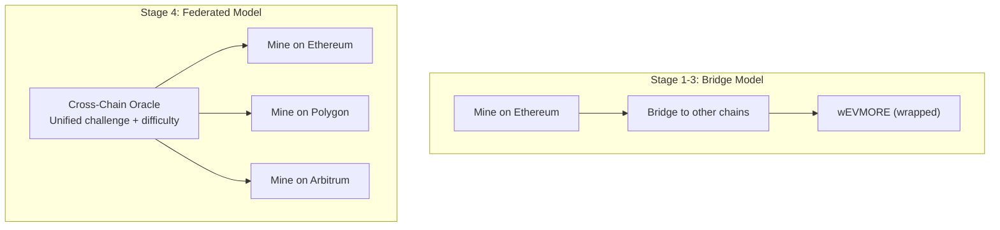
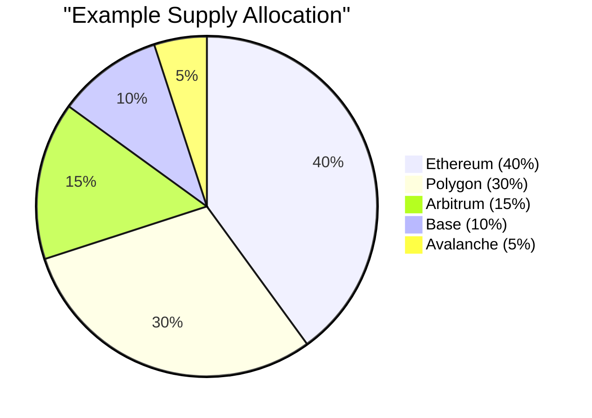
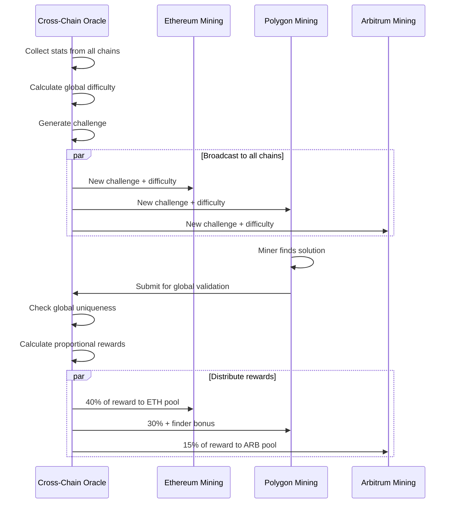

# Federated Mining

Federated mining is the Stage 4 vision for EVMORE, where tokens can be mined **natively** on multiple EVM chains simultaneously, rather than being bridged from Ethereum. This eliminates bridge risk and distributes mining load across the network.

---

## Concept

In Stages 1-3, all EVMORE is mined on Ethereum and bridged to other chains as wrapped tokens. In Stage 4, each chain runs its own mining contract, coordinated by a cross-chain oracle to ensure a unified 21M supply and consistent difficulty.

---

## How It Works

### Unified Challenge

The cross-chain oracle generates a **single mining challenge** that is broadcast to all participating chains. Every miner, regardless of which chain they're on, works on the same puzzle.

### Global Solution Uniqueness

When a miner finds a solution on any chain:

1. The local chain contract verifies the solution
2. The oracle checks the solution against a **global** used-solutions registry
3. If unique, the solution is accepted and rewards are distributed
4. The solution is marked as used across **all** chains

This prevents the same solution from being submitted on multiple chains.

### Proportional Rewards

Each chain has a supply allocation based on its share of total mining activity:

When a solution is found, the 50 EVMORE block reward is distributed across all chains proportionally. The miner who found the solution receives their chain's share plus a finder bonus.

---

## Oracle Architecture

### Oracle Security

- **Multi-signature**: Oracle operations require multiple operator signatures
- **Time-based expiry**: Challenges expire after 10 minutes
- **Rate limiting**: Throttles solution submissions to prevent spam
- **Emergency pause**: Immediate halt capability

---

## Benefits

### For Miners

| Benefit | Description |
|---------|-------------|
| Geographic optimization | Mine on whichever chain has lowest gas costs |
| Reduced competition | Mining load distributed across chains |
| Chain choice | Pick the chain that fits your infrastructure |
| Network resilience | Not dependent on a single chain's availability |

### For Users

| Benefit | Description |
|---------|-------------|
| Native tokens | EVMORE exists natively on each chain, not as a wrapped version |
| No bridge risk | No bridge exploit can drain supply |
| Lower fees | Use the cheapest chain for transactions |
| Unified liquidity | Combined liquidity from all chains |

### For the Ecosystem

| Benefit | Description |
|---------|-------------|
| Scalability | Mining throughput scales with the number of chains |
| Future-proof | New EVM chains can be added as they launch |
| True multi-chain | Not just token presence, but native mining on each chain |

---

## Challenges and Tradeoffs

| Challenge | Mitigation |
|-----------|------------|
| Oracle dependency | Multi-sig operators, decentralized oracle set |
| Cross-chain latency | 10-minute epoch provides buffer for sync |
| Higher complexity | Only deployed after ecosystem maturity (100K EVMORE treasury) |
| Liquidity fragmentation | Coordinated market-making across chains |

---

## Prerequisites

Federated mining activates only when:

- Treasury reaches **100,000 EVMORE** (Stage 4 threshold)
- Cross-chain oracle infrastructure is deployed and tested
- Multiple chains have established EVMORE communities
- Security audits of the federated mining contracts are complete

---

## Further Reading

- [Staged Deployment](staged-deployment.md) -- The path to Stage 4
- [Cross-Chain Bridge](cross-chain-bridge.md) -- The Stage 2-3 bridge that federated mining replaces
- [KeccakCollision Algorithm](../mining/mining-algorithm.md) -- The mining algorithm used across all chains
- [Architecture Overview](overview.md) -- System architecture context
