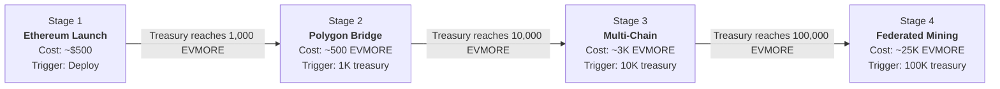
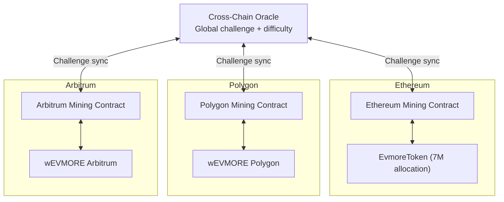

# Staged Deployment

EVMORE uses a self-funding 4-stage deployment model. Each stage is activated when the treasury accumulates enough EVMORE through mining, meaning the project bootstraps itself with zero external funding beyond the initial deployment cost.

---

## Stage Overview

---

## Stage 1: Ethereum Launch

**Trigger:** Initial deployment (~$500 in ETH for gas)

**What's deployed:**

- `KeccakCollisionVerifier.vy` -- Mining verification contract
- `EvmoreToken.vy` -- Token contract with integrated mining

**Capabilities:**

- Full ERC-20 token with mining
- Solo and pool mining on Ethereum
- Epoch-based reward distribution
- Difficulty adjustment
- Bridge hooks (dormant, ready for Stage 2)

**Economics:**

| Metric | Value |
|--------|-------|
| Deployment gas | ~2M gas (~$120 at 30 gwei) |
| Mining reward | 50 EVMORE per epoch |
| Target block time | 10 minutes |
| Daily supply | ~7,200 EVMORE |

---

## Stage 2: Polygon Bridge

**Trigger:** Treasury accumulates 1,000 EVMORE

**What's deployed:**

- `EVMOREBridgeStage2.vy` -- Manual processing bridge on Ethereum
- `wEVMOREPolygon.vy` -- Wrapped EVMORE token on Polygon

**Capabilities:**

- Ethereum to Polygon bridging (and back)
- Manual bridge operator processing
- Conservative limits for safety

**Bridge parameters:**

| Parameter | Value |
|-----------|-------|
| Minimum bridge amount | 1 EVMORE |
| Maximum bridge amount | 10,000 EVMORE |
| Processing | Manual operator |
| Withdrawal delay | 1 hour |
| Fee | 0.1% |

---

## Stage 3: Multi-Chain Expansion

**Trigger:** Treasury accumulates 10,000 EVMORE

**What's deployed:**

- `EVMOREBridge.vy` -- Automated multi-chain bridge with multi-sig validation

**New chains:**

| Chain | Fee | Daily Limit |
|-------|-----|-------------|
| Polygon | 0.1% | 1,000,000 EVMORE |
| Arbitrum | 0.15% | 1,000,000 EVMORE |
| Base | 0.2% | 500,000 EVMORE |
| Optimism | 0.25% | 500,000 EVMORE |
| Avalanche | 0.3% | 250,000 EVMORE |

**Security upgrades:**

- Multi-signature validation (minimum 3 validators, up to 20)
- Automated processing
- Per-user rate limiting (10% of daily limit)
- Emergency pause functionality

---

## Stage 4: Federated Mining

**Trigger:** Treasury accumulates 100,000 EVMORE

**What's deployed:**

- Cross-chain oracle network
- Federated mining coordinator contracts on each chain

**Capabilities:**

- Mine EVMORE natively on any supported chain
- Unified challenge across all chains
- Global difficulty adjustment based on combined hash rate
- Cross-chain solution uniqueness enforcement
- Proportional reward distribution across chains

---

## Migration Process

Stage transitions are managed by the `migration_manager.py` script, which:

1. Checks the current treasury balance against the next stage threshold
2. Deploys the new contracts for the target stage
3. Activates bridge hooks on the token contract (Stage 2+)
4. Verifies the deployment
5. Updates configuration

All migrations are **zero-downtime** -- mining continues uninterrupted while new capabilities are added.

---

## Deployment Costs

| Stage | Gas Estimate | Approximate USD (@ $2000 ETH, 30 gwei) |
|-------|-------------|----------------------------------------|
| Stage 1 | ~2M gas | ~$120 |
| Stage 2 | ~1.5M gas | ~$90 |
| Stage 3 | ~3M gas | ~$180 |
| Stage 4 | ~5M gas | ~$300 |

---

## Further Reading

- [Architecture Overview](overview.md) -- How the contracts work together
- [Cross-Chain Bridge](cross-chain-bridge.md) -- Bridge architecture details
- [Federated Mining](federated-mining.md) -- Stage 4 deep dive
- [Developer Getting Started](../developers/getting-started.md) -- Deploy locally
