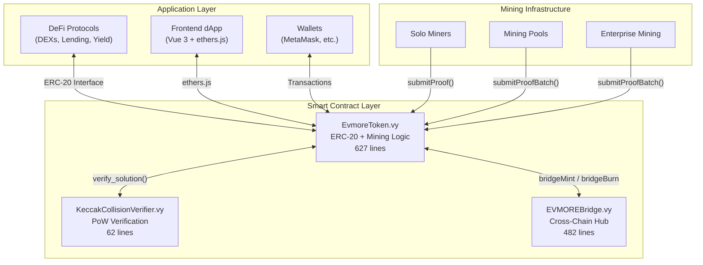
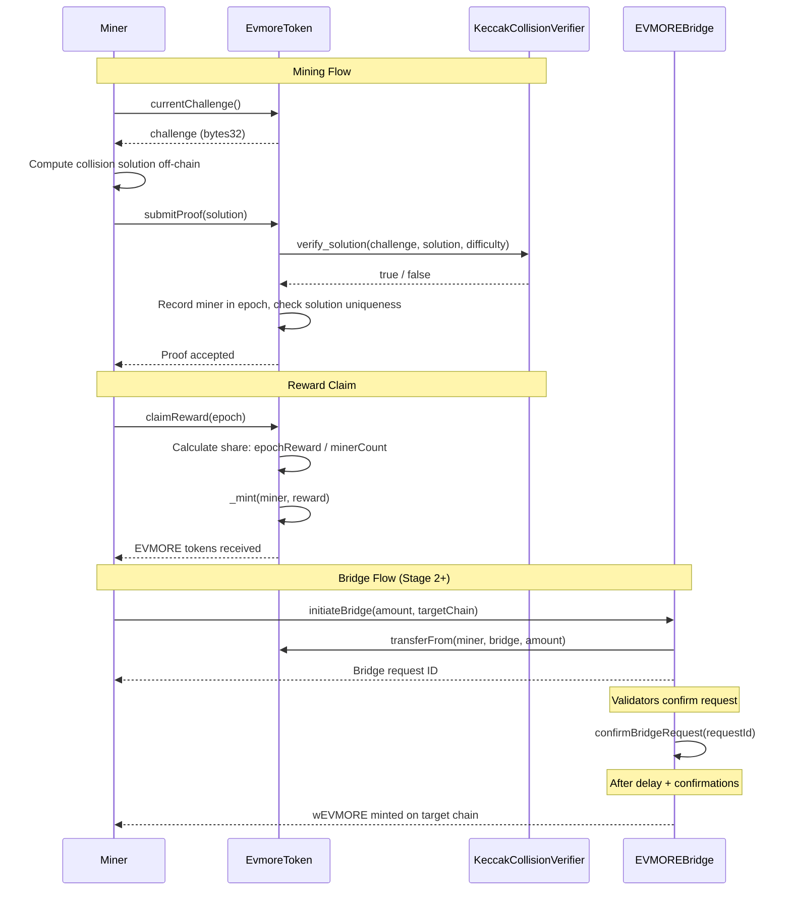

# Architecture Overview

EVMORE is built as a set of Vyper smart contracts on Ethereum, designed with a clear separation between token logic, mining verification, and cross-chain bridging. The architecture supports a staged deployment model that progressively expands from Ethereum-only to federated multi-chain mining.

---

## System Architecture

---

## Contract Interaction Flow

The following sequence shows the complete lifecycle of mining, claiming, and bridging:

---

## Core Contracts

### EvmoreToken.vy (627 lines)

The central contract combining ERC-20 functionality with integrated mining.

**Key responsibilities:**

- Full ERC-20 token implementation (transfer, approve, balanceOf, etc.)
- Mining proof submission and validation (single and batch)
- Epoch-based reward distribution with fair splitting
- Difficulty adjustment every 2,016 blocks
- Halving schedule (50 -> 25 -> 12.5 EVMORE, etc.)
- Bridge hooks (dormant until activated in Stage 2+)
- Pause/unpause and two-step ownership transfer

**Security features:**

- Reentrancy guards on all state-changing functions
- Global solution hash tracking to prevent replay attacks
- Maximum supply enforcement (21M hard cap)
- Two-step ownership transfer to prevent accidental loss

### KeccakCollisionVerifier.vy (62 lines)

A pure verification contract with a single view function.

- `verify_solution(challenge, solution, difficulty) -> bool`
- Parses 4 x 32-byte values from the 128-byte solution
- Verifies ascending order and matching bit patterns
- Inline mask computation, branch-optimized for difficulty <= 32
- Gas-optimized for on-chain verification

### EVMOREBridge.vy (482 lines)

Production-grade hub-and-spoke bridge for Stage 3+ deployment.

**Supported chains:**

| Chain | Fee | Daily Limit |
|-------|-----|-------------|
| Polygon | 0.1% | 1,000,000 EVMORE |
| Arbitrum | 0.15% | 1,000,000 EVMORE |
| Base | 0.2% | 500,000 EVMORE |
| Optimism | 0.25% | 500,000 EVMORE |
| Avalanche | 0.3% | 250,000 EVMORE |

**Security model:** Multi-signature validation (min 3 validators), withdrawal delays, per-user rate limiting (10% of daily limit), and emergency pause functionality.

### Bridge Stage 2 Contracts

- **EVMOREBridgeStage2.vy** (338 lines) -- Simplified manual bridge for Ethereum-Polygon
- **wEVMOREPolygon.vy** (236 lines) -- Wrapped EVMORE token on Polygon

---

## Design Principles

1. **Security first**: Checks-effects-interactions pattern, reentrancy guards, two-step ownership
2. **Staged complexity**: Simple Ethereum-only at launch, complexity added only when funded by treasury
3. **On-chain verification**: All mining proofs verified in smart contracts, not off-chain
4. **Fair distribution**: No premine, no team allocation, 100% mined
5. **Migration-ready**: Bridge hooks built into the token contract from day one

---

## Further Reading

- [Staged Deployment](staged-deployment.md) -- How the 4-stage architecture works
- [Cross-Chain Bridge](cross-chain-bridge.md) -- Bridge design details
- [Smart Contract Reference](../contracts/reference.md) -- Full API documentation
- [KeccakCollision Algorithm](../mining/mining-algorithm.md) -- Mining algorithm deep dive
