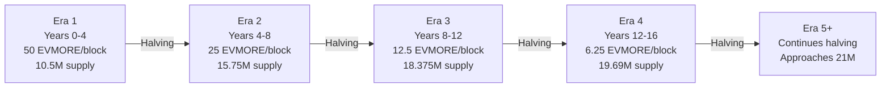

# EVMORE Economics

Understanding the economic model that makes EVMORE a true digital gold.

## The Digital Gold Standard

EVMORE is designed to replicate the economic properties that have made gold valuable for 5,000 years, while adding the benefits of digital technology.

### Core Economic Properties

| Property | Physical Gold | EVMORE |
|----------|---------------|--------|
| **Scarcity** | ~200,000 tonnes ever mined | 21 million maximum |
| **New Supply** | ~3,000 tonnes/year (1.5%) | Decreasing via halving |
| **Mining Cost** | Energy + equipment + labor | Computational work |
| **Verification** | Assaying required | Mathematical proof |
| **Divisibility** | Limited (gram minimum) | 18 decimal places |
| **Portability** | Physical transport needed | Instant digital transfer |

## Supply Model

### Fixed Maximum Supply

EVMORE has a hard cap of **21 million tokens**. This limit is enforced by the smart contract and cannot be changed.

```
Maximum Supply: 21,000,000 EVMORE
Smallest Unit: 0.000000000000000001 EVMORE (18 decimals)
Total Units: 21,000,000,000,000,000,000,000,000 (21 × 10^24)
```

### Halving Schedule

Like Bitcoin, EVMORE's block reward halves approximately every 4 years:



| Era | Years | Block Reward | New Supply | Total Supply | % Mined |
|-----|-------|--------------|------------|--------------|---------|
| 1 | 0-4 | 50 EVMORE | 10.5M | 10.5M | 50% |
| 2 | 4-8 | 25 EVMORE | 5.25M | 15.75M | 75% |
| 3 | 8-12 | 12.5 EVMORE | 2.625M | 18.375M | 87.5% |
| 4 | 12-16 | 6.25 EVMORE | 1.3125M | 19.6875M | 93.75% |
| 5 | 16-20 | 3.125 EVMORE | 656K | 20.34375M | 96.88% |
| 6 | 20-24 | 1.5625 EVMORE | 328K | 20.67M | 98.44% |
| 7 | 24-28 | 0.78125 EVMORE | 164K | 20.84M | 99.22% |
| ... | ... | continues halving | ... | approaches 21M | ~100% |

### Inflation Rate Over Time

EVMORE's inflation rate decreases predictably:

| Year | Annual Inflation | Notes |
|------|------------------|-------|
| 0 | High (new token) | Initial distribution phase |
| 4 | ~12.5% | First halving |
| 8 | ~5.6% | Second halving |
| 12 | ~2.5% | Third halving |
| 16 | ~1.2% | Fourth halving |
| 20 | ~0.6% | Fifth halving |
| 40+ | <0.1% | Negligible new supply |

Compare to:
- **Gold**: ~1.5% annual supply increase
- **US Dollar**: ~2-3% target inflation (often higher)
- **Bitcoin**: ~1.8% current inflation (post-2024 halving)

## Mining Economics

### Block Rewards

New EVMORE enters circulation only through mining. The reward structure incentivizes early participation while ensuring long-term sustainability.

**Current reward**: 50 EVMORE per block
**Block time**: ~10 minutes
**Blocks per day**: ~144
**Daily new supply**: ~7,200 EVMORE

### Difficulty Adjustment

The mining difficulty adjusts to maintain consistent block times:

- **More miners** → difficulty increases → block time stays ~10 min
- **Fewer miners** → difficulty decreases → block time stays ~10 min

This ensures:
- Predictable token issuance
- Fair competition as network grows
- Stability regardless of hashrate changes

### Mining Profitability

Mining profitability depends on:

1. **Block reward**: How much you earn per block
2. **Network hashrate**: Your share of total mining power
3. **EVMORE price**: Market value of rewards
4. **Costs**: Hardware, electricity, maintenance

**Simplified formula:**
```
Daily Profit = (Your Hashrate / Total Hashrate) × Daily Blocks × Reward × Price - Costs
```

## Value Proposition

### Why EVMORE Has Value

1. **Scarcity**: Fixed 21M supply creates digital scarcity
2. **Utility**: Usable in DeFi, payments, store of value
3. **Work Requirement**: Every token requires real computational effort
4. **Verifiability**: Anyone can verify the supply and mining rules
5. **Decentralization**: No central authority controls issuance

### Comparison with Other Assets

| Asset | Supply Control | Verification | Portability | Programmability |
|-------|---------------|--------------|-------------|-----------------|
| Gold | Geological | Assaying | Physical | None |
| USD | Central bank | Trust-based | Physical/digital | Limited |
| Bitcoin | Algorithm | Blockchain | Digital | Limited |
| **EVMORE** | Algorithm | Blockchain | Digital | Full (ERC-20) |

### Store of Value Properties

EVMORE is designed as a store of value because:

- **Non-inflatable**: Cannot print more after 21M
- **Unseizable**: Self-custody with private keys
- **Borderless**: Works anywhere with internet
- **Permissionless**: No approval needed to use
- **Trustless**: Math, not institutions, secure it

## DeFi Integration

### Collateral Value

EVMORE can serve as collateral in DeFi:
- **Lending**: Deposit EVMORE, borrow stablecoins
- **Margin trading**: Use as margin for leveraged positions
- **Synthetic assets**: Collateralize synthetic positions

### Liquidity Provision

Earn yield by providing liquidity:
- **DEX pools**: EVMORE/ETH, EVMORE/USDC pairs
- **Trading fees**: Earn from every trade in the pool
- **Yield farming**: Additional token rewards

### Lending and Borrowing

Once integrated with lending protocols:
- **Supply EVMORE**: Earn interest from borrowers
- **Borrow against EVMORE**: Access liquidity without selling

## Economic Security

### Cost to Attack

The mining economics create security:

```
Attack Cost = Hardware Cost + Electricity Cost + Opportunity Cost

Where:
- Hardware Cost = Equipment to achieve 51% hashrate
- Electricity Cost = Power to run attack
- Opportunity Cost = Forgone honest mining rewards
```

The higher the network hashrate, the more expensive attacks become.

### Incentive Alignment

Miners are incentivized to act honestly:
- **Honest mining**: Earn steady rewards
- **Attacking**: Risk hardware investment, uncertain gain
- **Long-term**: Honest miners benefit from network value growth

## Fair Distribution

### No Premine Advantages

EVMORE's fair launch means:
- No founder allocation
- No investor tokens
- No team reserves
- Everyone mines on equal terms

### Early Adopter Advantage

Early participants benefit from:
- Lower difficulty (easier mining)
- Higher block rewards (before halvings)
- First-mover positioning

This creates natural incentives for early adoption without unfair allocation.

## Long-Term Economics

### Post-Mining Era

When all 21M EVMORE are mined (~100+ years):
- No new token inflation
- Transaction fees sustain miners
- Pure scarcity economics

### Deflation Potential

If tokens are lost (forgotten wallets, sent to burn addresses):
- Effective supply decreases
- Each remaining token becomes scarcer
- Potential for purchasing power increase

### Adoption Curves

Economic impact at different adoption levels:

| Adoption Level | Potential Market Cap | Price Impact |
|----------------|---------------------|--------------|
| Niche (1M users) | $1-10B | $50-500/EVMORE |
| Growth (10M users) | $10-100B | $500-5,000/EVMORE |
| Mainstream (100M users) | $100B-1T | $5,000-50,000/EVMORE |

*These are illustrative scenarios, not predictions.*

## Comparison: Digital vs Physical Gold

### Advantages of EVMORE

| Advantage | Explanation |
|-----------|-------------|
| **No storage costs** | Self-custody is free |
| **Instant transfer** | Minutes vs days/weeks |
| **Perfect divisibility** | Send 0.00001 EVMORE easily |
| **Programmable** | Smart contract integration |
| **Verifiable supply** | Anyone can audit blockchain |
| **No counterfeiting** | Mathematically impossible |

### Advantages of Physical Gold

| Advantage | Explanation |
|-----------|-------------|
| **5,000 year track record** | Proven store of value |
| **Physical tangibility** | Can hold in your hand |
| **No technology risk** | Works without internet |
| **Established markets** | Deep liquidity globally |

## Summary

### Key Economic Facts

| Metric | Value |
|--------|-------|
| Maximum Supply | 21,000,000 EVMORE |
| Current Block Reward | 50 EVMORE |
| Halving Period | ~4 years (210,000 blocks) |
| Block Time | ~10 minutes |
| Decimals | 18 |
| Premine | 0 (fair launch) |

### Investment Considerations

**Potential benefits:**
- Fixed supply (scarcity)
- Fair distribution
- DeFi utility
- Mining accessibility

**Potential risks:**
- Price volatility
- Regulatory uncertainty
- Technical risks
- Market adoption uncertainty

*This is educational content, not financial advice. Do your own research and consider your risk tolerance before participating.*

## Further Reading

- [What is EVMORE?](what-is-evmore.md) - Technical overview
- [Mining Guide](../mining/mining-guide.md) - Earn EVMORE
- [FAQ](faq.md) - Common questions
- [Technical Economics](../../docs/economics/digital-gold-economics.md) - Deep dive
