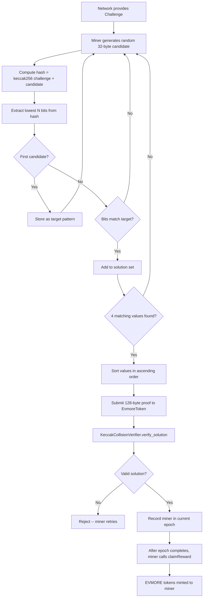

# KeccakCollision Mining Algorithm

EVMORE uses **KeccakCollision**, a memory-hard proof-of-work algorithm that requires miners to find multiple values whose Keccak-256 hashes share a common bit pattern. This approach is fundamentally different from traditional hash-based mining.

---

## How It Works

Traditional mining (e.g., Bitcoin) asks: *find a nonce such that the hash has leading zeros*. KeccakCollision asks: *find 4 values whose hashes collide on the lowest N bits*.

### Parameters

| Parameter | Value | Description |
|-----------|-------|-------------|
| **K** | 4 | Number of values required per solution |
| **N (difficulty)** | dynamic (initial 8) | Number of bits that must match across all hashes -- set by the token's `currentDifficulty` and adjusted every 2,016 blocks |
| **Solution size** | 128 bytes | K x 32 bytes per value |
| **Hash function** | Keccak-256 | Ethereum-native hash |

### Algorithm Flow



### Step-by-Step

1. **Get the challenge**: The network provides a `bytes32` challenge derived from the previous block hash, timestamp, and epoch data.

2. **Search for collisions**: The miner generates random 32-byte values and hashes each one with the challenge:

    ```python
    hash_result = keccak256(challenge + candidate_value)
    pattern = hash_result & ((1 << difficulty) - 1)  # Extract lowest N bits
    ```

3. **Find 4 matches**: The miner must find 4 different values that all produce the **same** lowest-N-bit pattern (where N is the current difficulty). At the initial difficulty of 8 bits, each candidate has a 1-in-256 chance of matching the target pattern; at 16 bits, a 1-in-65,536 chance.

4. **Order and submit**: The 4 values must be sorted in strictly ascending order (as `uint256`), then concatenated into a 128-byte solution and submitted on-chain.

5. **On-chain verification**: The `KeccakCollisionVerifier` contract re-hashes each value and confirms:
    - All 4 values produce matching bit patterns
    - Values are in strictly ascending order
    - The solution hasn't been used before

---

## Why Memory-Hard?

KeccakCollision is memory-hard because efficient mining requires:

- **Large lookup tables**: Storing hash-to-pattern mappings to find collisions faster
- **Random memory access**: Pattern matching requires scanning previously computed results
- **Bandwidth-bound**: Performance is limited by memory throughput, not raw compute

This design has practical consequences:

| Property | Effect |
|----------|--------|
| ASIC resistance | Custom silicon cannot easily optimize memory-random access patterns |
| GPU/CPU fairness | Consumer hardware with fast memory is competitive |
| Energy efficiency | Memory operations use less power per useful computation than pure hashing |
| Decentralization | No single hardware class dominates mining |

---

## Difficulty Adjustment

The network automatically adjusts mining difficulty to maintain a consistent ~10 minute block time.

| Parameter | Value |
|-----------|-------|
| Target block time | 600 seconds (10 minutes) |
| Adjustment interval | Every 2,016 blocks (~2 weeks) |
| Maximum change | 4x increase or decrease per interval |
| Minimum difficulty | 8 bits (enforced floor in `_adjust_difficulty`) |

**How it works:**

- If blocks are found **faster** than 10 minutes, difficulty increases (more bits must match)
- If blocks are found **slower** than 10 minutes, difficulty decreases (fewer bits must match)
- The maximum adjustment per interval is capped at 4x to prevent instability

---

## On-Chain Verification

Unlike Bitcoin, where verification happens at the node level, EVMORE verifies proofs directly in a smart contract. This enables:

- **Smart contract composability**: Other contracts can verify mining proofs
- **Transparent validation**: Anyone can read the verification logic
- **No trusted miners**: The blockchain enforces all rules

The verification contract (`KeccakCollisionVerifier.vy`) is only 62 lines. It computes the difficulty mask inline: for difficulty <= 32 it uses `(1 << difficulty) - 1`; for higher difficulties it falls back to `max_value(uint256) >> (256 - difficulty)`.

---

## Comparison with Other PoW Algorithms

| Algorithm | Used By | Hardware | Memory | Verification |
|-----------|---------|----------|--------|--------------|
| SHA-256 | Bitcoin | ASIC-dominated | Low | Off-chain |
| Ethash | Ethereum (legacy) | GPU-optimized | High (DAG) | Off-chain |
| RandomX | Monero | CPU-optimized | High | Off-chain |
| **KeccakCollision** | **EVMORE** | **GPU/CPU fair** | **High** | **On-chain** |

---

## Further Reading

- [Mining Guide](mining-guide.md) -- Practical setup and optimization
- [Smart Contract Reference](../contracts/reference.md) -- KeccakCollisionVerifier API
- [Architecture Overview](../architecture/overview.md) -- How mining fits into the broader system
